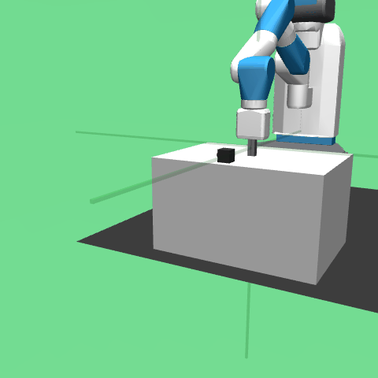
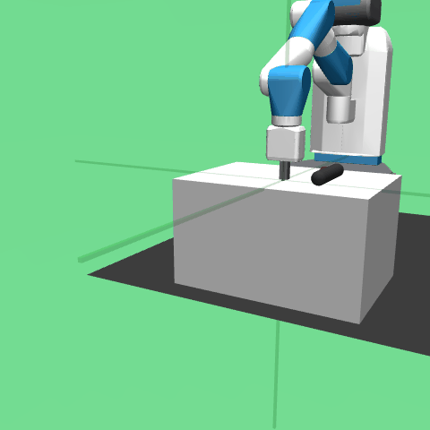

# drl_projekt
Deep Reinforcement Learning Projekt with Jesus

Algorithms to implement: DDPG (optionally TD3, SAC)

https://spinningup.openai.com/en/latest/algorithms/ddpg.html

oder hier noch das original DDPG paper

https://arxiv.org/abs/1509.02971

TD3 paper

https://arxiv.org/abs/1802.09477

---

`main.py` wird alles initialisiert was benötigt wird (Actor, Critic, ReplayBuffer, etc.)\
Es wird alles in einem `Agent`-Objekt zusammengeführt (DDPG oder TD3 bis jetzt, files in `agents\`)\
Dann wird der `Trainer` (`trainer\trainer.py`) aufgerufen, welcher in `train()` über die Episoden iteriert.\
In jeder Episode wird dann `agent.update()` aufgerufen (Update von Actor, Critic und Targets)\

---

Mögliche `object_type` in MuJoCo sind `[plane, hfield, sphere, capsule, ellipsoid, cylinder, box, mesh, sdf]`.

Hier einige Beispiele:

<table>
  <tr>
    <td align="center">
       
      Box
    </td>
    <td align="center">
       
      Sphere
    </td>
  </tr>
  <tr>
    <td align="center">
       
      Ellipsoid
    </td>
    <td align="center">
       
      Capsule
    </td>
  </tr>
</table>

TOTO
- example run or animation not just loss or reward
- fix TD3, try with more trials and observe animations in runs (not throw an object from the table and knowing how to move)
- The different seeds is something we can test with same or different seeds and see the effect (Test and then send an email after extensive testing)
- The shape changes, the fact that they're changed in XML isn't a problem if the animations show it works (see phycics simulations with shape change)
- The losses are not a good indicator of performance
- Further control checks: is there any movement in the object -> Check gow the object moves, how the gripper moves after e.g. 10k steps
- Additional control measures: Think about the geometric relations that you would get --> whatever closest distance that the arm gets to the object or the object gets to the precision, how much friction at the time the arm was touching object
- It's basically about an object being touched and moved, so these measures can help

<table>
  <tr>
    <td align="center">
       
      Before override
    </td>
    <td align="center">
       
      After override
    </td>
  </tr>
</table>
